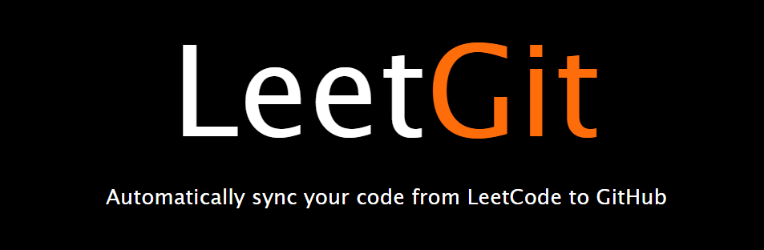

<div align="center">
    
</div>

<p align="center">
  <a href="https://github.com/prabhjot0109/LeetGit/blob/main/LICENSE">
    
  </a>
  <a href="https://github.com/prabhjot0109/LeetGit/stargazers">
    
  </a>
  <a href="https://github.com/prabhjot0109/LeetGit/issues">
    
  </a>
  
</p>

## What is LeetGit?

A Chrome extension that automatically pushes your code to GitHub when you pass all tests on a
<a href="https://leetcode.com/">LeetCode</a> or <a href="https://leetcode.cn/">LeetCode CN</a>
problem.

## Why LeetGit?

There's no easy way of accessing your LeetCode problems in one place, and pushing code manually to
GitHub from LeetCode is very time consuming. So why not automate it entirely without spending a
SINGLE additional second on it?

## Authentication: Personal Access Token

LeetGit authenticates to GitHub with a **Personal Access Token that you create and paste in
yourself**. There is no OAuth app, no backend, and no third party involved — the token is stored in
`chrome.storage.local` on your machine and is sent only to `api.github.com`.

Pick either token type:

| Token type           | What to grant                                                                                                                |
| -------------------- | ---------------------------------------------------------------------------------------------------------------------------- |
| **Classic PAT**      | Scope: `repo` — [create one](https://github.com/settings/tokens/new?scopes=repo&description=LeetGit)                         |
| **Fine-grained PAT** | Repository permissions → **Contents: Read and write** — [create one](https://github.com/settings/personal-access-tokens/new) |

> **Creating a new repository from the extension?** GitHub's `POST /user/repos` endpoint needs
> **Administration: Read and write** on a fine-grained PAT, and the token must be scoped to **All
> repositories** (a token limited to selected repositories cannot create a new one). If you'd rather
> keep the token narrow, create the repository yourself on GitHub and use **"Link an Existing
> Repository"** instead — that path only needs `Contents: Read and write`.

## Privacy / data handling

LeetGit talks to exactly three hosts, and nothing else:

- `leetcode.com` / `leetcode.cn` — reads your own submission via LeetCode's GraphQL API.
- `api.github.com` — pushes the solution to your repository with your token.
- Your browser's local storage — token, repo hook, and solve counts. Nothing is uploaded to
  `chrome.storage.sync`, so no LeetGit data ever leaves the device via Google's sync.

There is no analytics, no telemetry, no remote configuration, and no CDN: Semantic UI's CSS and icon
fonts are vendored under `src/css/static/` so opening the popup makes zero third-party requests.

Requested Chrome permissions are only `storage` and `unlimitedStorage`. Access to `api.github.com`
relies on GitHub's public CORS support rather than a host permission, so the extension never asks for
broad host access.

## Supported platforms

- **LeetCode.com** (English)
- **LeetCode.cn** (Chinese / 力扣)

## Supported UI

LeetGit works with two different LeetCode UIs. There are known issues with the "non-dynamic layout".
Please use one of the following:

1. **old layout**, or
2. new **"dynamic layout"**

## Manual synchronization

Your submission may not be successfully uploaded to GitHub if you update the text in the editor too
fast. Wait about 4 seconds (until the spinner stops) after submitting before entering new characters,
switching languages, or switching editors. During this period your solution is being pushed to
GitHub. If you find a better fix, PRs are welcome!

In the meantime there is a manual sync button next to the notes icon. Use it only after you have
successfully submitted your solution to LeetCode. You can also push previous submissions by selecting
the submission first and then clicking the manual sync button.

## Installation

LeetGit is not on the Chrome Web Store — install it unpacked from source:

1. Generate a GitHub Personal Access Token (see [Authentication](#authentication-personal-access-token) above).
2. Clone this repository, or download a ZIP from
   [Releases](https://github.com/prabhjot0109/LeetGit/releases):
   ```bash
   git clone https://github.com/prabhjot0109/LeetGit.git
   ```
3. Run `npm run setup` to install the developer dependencies (optional — only needed for linting and
   formatting; the extension itself has no build step).
4. Go to <a href="chrome://extensions">chrome://extensions</a>.
5. Enable **Developer mode** with the toggle in the top-right corner.
6. Click **"Load unpacked"** and select the entire `LeetGit` folder.

## Setup

1. After loading LeetGit, open the extension popup.
2. Paste your **GitHub Personal Access Token** and click **"Authenticate PAT"**.
3. Create or link a repository (private by default) by clicking **"Get Started"**.
4. Begin LeetCoding! To view your progress, click the extension icon.

## Supported npm commands

```bash
npm run               # Show available commands
npm run setup         # Install dependencies
npm run format        # Auto-format JavaScript, HTML/CSS
npm run format-test   # Test if code is formatted properly
npm run lint          # Lint JavaScript
npm run lint-test     # Test if code is linted properly
```

## Contribution

Pull requests are welcome. If you want a particular feature, simply
[request it](https://github.com/prabhjot0109/LeetGit/labels/feature).

## License

[MIT](LICENSE) © Prabhjot Singh
